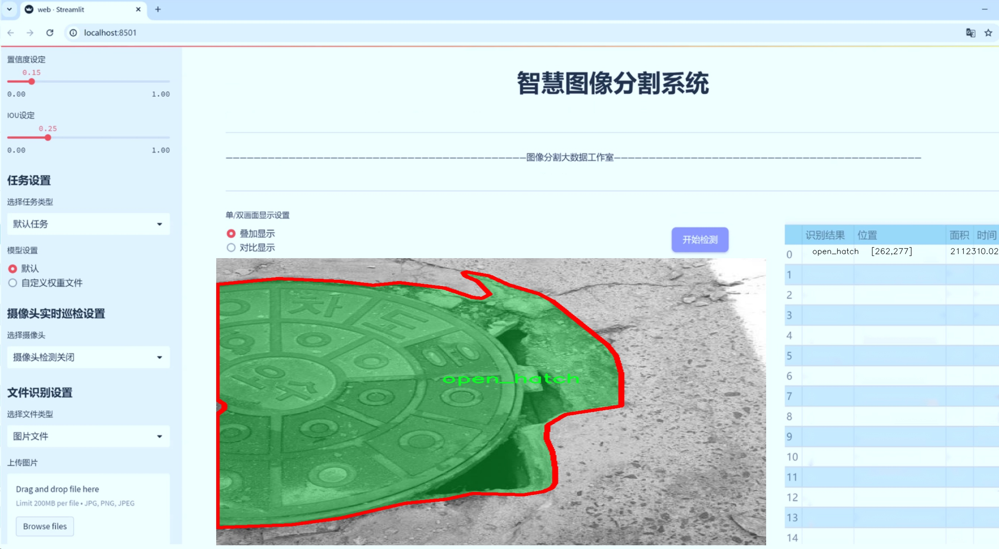
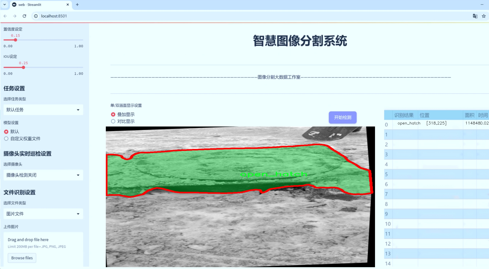
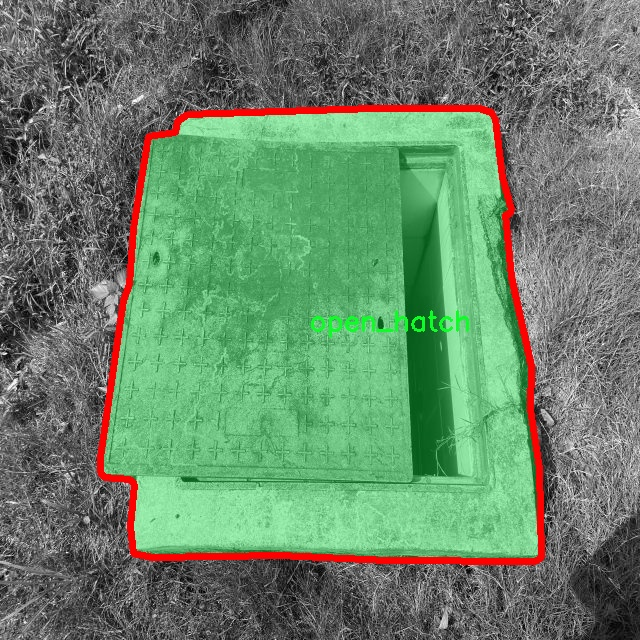
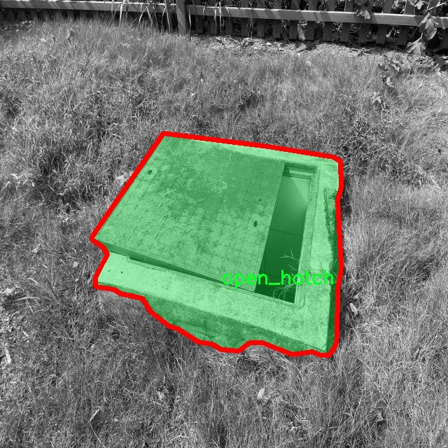
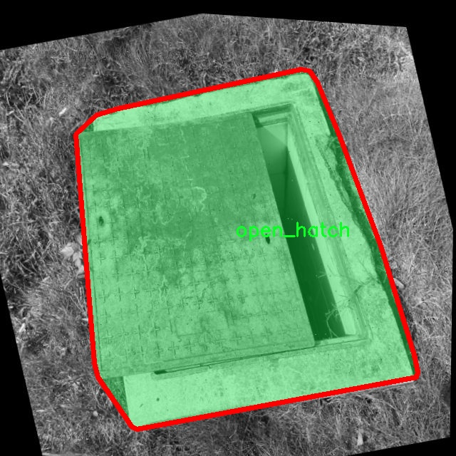
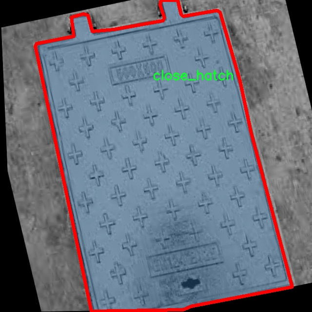
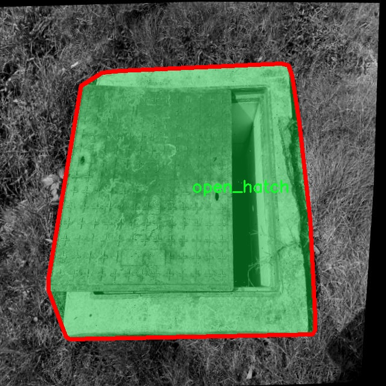

# 井盖开闭状态分类图像分割系统： yolov8-seg-EfficientFormerV2

### 1.研究背景与意义

[参考博客](https://gitee.com/YOLOv8_YOLOv11_Segmentation_Studio/projects)

[博客来源](https://kdocs.cn/l/cszuIiCKVNis)

研究背景与意义

随着城市化进程的加快，城市基础设施的管理与维护变得愈发重要。井盖作为城市排水系统的重要组成部分，其开闭状态的监测不仅关系到城市交通的安全与畅通，还直接影响到市民的生活质量和公共安全。传统的井盖状态监测方法多依赖人工巡查，效率低下且容易受到人为因素的影响，无法满足现代城市管理的需求。因此，开发一种高效、自动化的井盖开闭状态分类与图像分割系统显得尤为必要。

近年来，深度学习技术的迅猛发展为图像处理领域带来了新的机遇，尤其是在目标检测与图像分割方面。YOLO（You Only Look Once）系列模型因其高效的实时性和准确性，已成为目标检测领域的热门选择。YOLOv8作为该系列的最新版本，进一步提升了模型的性能和应用范围。然而，针对井盖开闭状态的具体应用，现有的YOLOv8模型仍存在一定的局限性，尤其是在复杂环境下的图像分割精度和分类准确性方面。因此，基于改进YOLOv8的井盖开闭状态分类图像分割系统的研究具有重要的现实意义。

本研究所使用的数据集包含8600张图像，涵盖了井盖的三种状态：关闭、打开和物体遮挡。这一丰富的数据集为模型的训练与验证提供了坚实的基础。通过对不同状态下井盖图像的深入分析，可以有效提升模型对井盖状态的识别能力。此外，数据集中物体遮挡的类别也为模型的鲁棒性提供了挑战，进一步推动了图像分割技术的发展。研究表明，针对特定应用场景进行模型的改进与优化，可以显著提高目标检测与分割的精度。

本研究的意义不仅在于技术层面的创新，更在于其对城市管理的实际应用价值。通过实现井盖开闭状态的自动化监测，可以有效降低人工巡查的成本，提高工作效率，减少因井盖状态不当引发的安全事故。同时，该系统的推广应用将为城市智能管理提供有力支持，推动智慧城市的建设进程。此外，研究成果还可以为其他类似的基础设施监测提供借鉴，具有广泛的应用前景。

综上所述，基于改进YOLOv8的井盖开闭状态分类图像分割系统的研究，不仅具有重要的学术价值，更具备显著的社会意义。通过技术创新与实际应用的结合，能够为城市基础设施的智能化管理提供有效解决方案，推动城市可持续发展。

### 2.图片演示






注意：本项目提供完整的训练源码数据集和训练教程,由于此博客编辑较早,暂不提供权重文件（best.pt）,需要按照6.训练教程进行训练后实现上图效果。

### 3.视频演示

[3.1 视频演示](https://www.bilibili.com/video/BV19HmeYkEpF/)

### 4.数据集信息

##### 4.1 数据集类别数＆类别名

nc: 2
names: ['close_hatch', 'open_hatch']


##### 4.2 数据集信息简介

数据集信息展示

在本研究中，我们使用了名为“hatch”的数据集，以支持对井盖开闭状态的分类和图像分割任务。该数据集专门设计用于训练和评估改进版YOLOv8-seg模型，旨在提高井盖状态识别的准确性和效率。数据集的类别数量为2，分别为“close_hatch”和“open_hatch”，这两个类别代表了井盖的两种基本状态：关闭和打开。

“hatch”数据集的构建考虑到了实际应用中的多样性和复杂性。每个类别的图像均涵盖了不同的环境、光照条件和拍摄角度，以确保模型在实际应用中具有良好的泛化能力。关闭状态的井盖图像可能会呈现出不同的材质、颜色和污垢程度，而打开状态的井盖则可能展示出不同的内部结构和周围环境。这种多样性不仅增强了数据集的代表性，也为模型的训练提供了丰富的样本，确保其能够适应各种实际场景。

在数据集的标注过程中，采用了精确的图像分割技术，为每个类别的图像提供了高质量的掩膜。这些掩膜标注了井盖的轮廓，使得模型在进行图像分割时能够准确地识别和分离井盖与背景的关系。这种精细的标注方式对于训练YOLOv8-seg模型至关重要，因为它直接影响到模型的学习效果和最终的分割精度。

此外，数据集还考虑到了不同场景下井盖的背景变化。例如，井盖可能位于城市街道、乡村小道或工业区等不同环境中。每种环境的背景特征都有所不同，这要求模型不仅要识别井盖的状态，还要能够适应各种复杂的背景信息。这种背景多样性有助于提高模型在真实世界应用中的鲁棒性，使其能够在不同的环境中保持高效的识别能力。

为了确保数据集的质量和有效性，我们在数据收集和标注过程中采取了严格的标准。所有图像均经过专业人员的审核，确保每个标注的准确性和一致性。这种高标准的质量控制不仅提升了数据集的可信度，也为后续的模型训练和评估奠定了坚实的基础。

在训练过程中，我们将“hatch”数据集分为训练集和验证集，以便于对模型的性能进行评估和调优。通过对模型在不同数据集上的表现进行比较，我们能够更好地理解模型的学习效果，并根据需要进行参数调整和优化。

总之，“hatch”数据集为改进YOLOv8-seg的井盖开闭状态分类图像分割系统提供了丰富的训练资源和高质量的标注信息。通过充分利用这一数据集，我们期望能够显著提升井盖状态识别的准确性和效率，为城市基础设施的管理和维护提供有力的技术支持。











### 5.项目依赖环境部署教程（零基础手把手教学）

[5.1 环境部署教程链接（零基础手把手教学）](https://www.bilibili.com/video/BV1jG4Ve4E9t/?vd_source=bc9aec86d164b67a7004b996143742dc)


[5.2 安装Python虚拟环境创建和依赖库安装视频教程链接（零基础手把手教学）](https://www.bilibili.com/video/BV1nA4VeYEze/?vd_source=bc9aec86d164b67a7004b996143742dc)

### 6.手把手YOLOV8-seg训练视频教程（零基础手把手教学）

[6.1 手把手YOLOV8-seg训练视频教程（零基础小白有手就能学会）](https://www.bilibili.com/video/BV1cA4VeYETe/?vd_source=bc9aec86d164b67a7004b996143742dc)


按照上面的训练视频教程链接加载项目提供的数据集，运行train.py即可开始训练



     Epoch   gpu_mem       box       obj       cls    labels  img_size
     1/200     0G   0.01576   0.01955  0.007536        22      1280: 100%|██████████| 849/849 [14:42<00:00,  1.04s/it]
               Class     Images     Labels          P          R     mAP@.5 mAP@.5:.95: 100%|██████████| 213/213 [01:14<00:00,  2.87it/s]
                 all       3395      17314      0.994      0.957      0.0957      0.0843

     Epoch   gpu_mem       box       obj       cls    labels  img_size
     2/200     0G   0.01578   0.01923  0.007006        22      1280: 100%|██████████| 849/849 [14:44<00:00,  1.04s/it]
               Class     Images     Labels          P          R     mAP@.5 mAP@.5:.95: 100%|██████████| 213/213 [01:12<00:00,  2.95it/s]
                 all       3395      17314      0.996      0.956      0.0957      0.0845

     Epoch   gpu_mem       box       obj       cls    labels  img_size
     3/200     0G   0.01561    0.0191  0.006895        27      1280: 100%|██████████| 849/849 [10:56<00:00,  1.29it/s]
               Class     Images     Labels          P          R     mAP@.5 mAP@.5:.95: 100%|███████   | 187/213 [00:52<00:00,  4.04it/s]
                 all       3395      17314      0.996      0.957      0.0957      0.0845


### 7.50+种全套YOLOV8-seg创新点加载调参实验视频教程（一键加载写好的改进模型的配置文件）

[7.1 50+种全套YOLOV8-seg创新点加载调参实验视频教程（一键加载写好的改进模型的配置文件）](https://www.bilibili.com/video/BV1Hw4VePEXv/?vd_source=bc9aec86d164b67a7004b996143742dc)

### YOLOV8-seg算法简介

原始YOLOv8-seg算法原理

YOLOv8-seg算法是由Ultralytics公司于2023年推出的YOLO系列的最新版本，标志着目标检测和实例分割领域的又一次重大进步。YOLOv8不仅在速度和精度上超越了前代模型，还引入了一系列创新的技术和结构设计，使其在各种计算平台上都能高效运行。YOLOv8-seg特别针对图像分割任务进行了优化，结合了YOLOv8的强大特性，形成了一种高效的解决方案。

YOLOv8-seg的核心在于其独特的网络结构，包括Backbone、Neck和Head三个主要部分。Backbone负责特征提取，采用了CSP（Cross Stage Partial）结构，旨在通过分离特征提取过程来增强模型的表达能力。具体而言，YOLOv8-seg使用了C2f模块来替代YOLOv5中的C3模块，这一变化显著提升了特征提取的效率和准确性。C2f模块通过增加跳层连接和Split操作，增强了信息流动，促进了特征的多样性和丰富性。

在特征融合方面，YOLOv8-seg采用了PAN-FPN（Path Aggregation Network - Feature Pyramid Network）结构。这一结构通过多尺度特征融合，能够有效整合来自不同层次的特征信息，从而提高模型对复杂场景的理解能力。PAN-FPN不仅提升了特征的表达能力，还增强了模型在小目标检测和高分辨率图像处理中的表现，尤其在处理复杂背景时，能够更好地分离目标与背景。

YOLOv8-seg的检测网络采用了Anchor-Free的检测方式，这一创新使得模型在处理不同尺度的目标时更加灵活。传统的Anchor-Based方法往往需要手动设置锚框，而YOLOv8-seg通过解耦头结构，消除了对锚框的依赖。这种设计不仅简化了模型的训练过程，还提高了检测的准确性和效率。解耦头结构将分类和回归任务分开处理，使得模型在进行目标分类和位置回归时能够更专注于各自的任务，从而提升了整体性能。

在损失函数方面，YOLOv8-seg引入了CloU损失函数，这一损失函数在目标检测和实例分割任务中表现出色。CloU损失函数通过考虑目标的形状和位置，能够更好地指导模型学习，提高了分割精度。与传统的损失函数相比，CloU损失函数更能适应复杂场景下的目标变化，使得YOLOv8-seg在处理各种数据集时都能保持较高的准确性。

YOLOv8-seg的模型设置也相当灵活，用户可以根据具体任务需求调整模型的深度和宽度。通过调整depth_factor和width_factor参数，用户可以轻松地改变模型的规模，从而在不同的硬件平台上实现最佳性能。这种灵活性使得YOLOv8-seg不仅适用于高性能的GPU服务器，也能在资源有限的设备上运行，展现出良好的适应性。

在训练过程中，YOLOv8-seg通过引入多种数据增强技术，进一步提升了模型的鲁棒性。数据增强不仅可以增加训练样本的多样性，还能有效防止模型过拟合，从而提高模型在真实场景中的泛化能力。结合YOLOv8-seg的高效结构和先进的训练策略，使得该模型在各类数据集上均表现出色，尤其是在COCO和Pascal VOC等标准数据集上，YOLOv8-seg的mAP（mean Average Precision）指标均显著优于前代模型。

此外，YOLOv8-seg还原生支持自定义数据集的训练，用户可以根据自己的需求，轻松地将特定领域的数据集引入模型进行训练。这一特性极大地扩展了YOLOv8-seg的应用范围，使其能够广泛应用于医疗影像分析、自动驾驶、智能监控等多个领域。

总的来说，YOLOv8-seg算法通过引入一系列创新的设计和技术，极大地提升了目标检测和实例分割的性能。其独特的网络结构、灵活的模型设置、先进的损失函数以及强大的数据增强能力，使得YOLOv8-seg在当前计算机视觉领域中占据了重要的地位。随着技术的不断发展，YOLOv8-seg无疑将为更多的实际应用场景提供高效、准确的解决方案，推动目标检测和实例分割技术的进一步发展。


### 9.系统功能展示（检测对象为举例，实际内容以本项目数据集为准）

图9.1.系统支持检测结果表格显示

  图9.2.系统支持置信度和IOU阈值手动调节

  图9.3.系统支持自定义加载权重文件best.pt(需要你通过步骤5中训练获得)

  图9.4.系统支持摄像头实时识别

  图9.5.系统支持图片识别

  图9.6.系统支持视频识别

  图9.7.系统支持识别结果文件自动保存

  图9.8.系统支持Excel导出检测结果数据


### 10.50+种全套YOLOV8-seg创新点原理讲解（非科班也可以轻松写刊发刊，V11版本正在科研待更新）

#### 10.1 由于篇幅限制，每个创新点的具体原理讲解就不一一展开，具体见下列网址中的创新点对应子项目的技术原理博客网址【Blog】：


[10.1 50+种全套YOLOV8-seg创新点原理讲解链接](https://gitee.com/qunmasj/good)

#### 10.2 部分改进模块原理讲解(完整的改进原理见上图和技术博客链接)【如果此小节的图加载失败可以通过CSDN或者Github搜索该博客的标题访问原始博客，原始博客图片显示正常】
### 全维动态卷积ODConv
鉴于上述讨论，我们的ODConv引入了一种多维注意机制，该机制具有并行策略，用于学习卷积核在核空间的所有四个维度上的不同注意。图提供了CondConv、DyConv和ODConv的示意性比较。

ODConv的公式：根据等式1中的符号，ODConv可定义为


 将注意力标量分配给整个卷积核。图2示出了将这四种类型的关注乘以n个卷积核的过程。原则上，这四种类型的关注是相互补充的，并且以位置、信道、滤波器和核的顺序将它们逐步乘以卷积核 
 ，使得卷积运算不同w.r.t.所有空间位置、所有输入信道、所有滤波器和输入x的所有核，提供捕获丰富上下文线索的性能保证。因此，ODConv可以显著增强CNN基本卷积运算的特征提取能力。此外，具有单个卷积核的ODConv可以与标准CondConv和DyConv竞争或优于它们，为最终模型引入的额外参数大大减少。提供了大量实验来验证这些优点。通过比较等式1和等式2，我们可以清楚地看到，ODConv是一种更广义的动态卷积。此外，当设置n=1且 所有分量均为1时，只关注滤波器方向 的ODConv将减少为：将基于输入特征的SE变量应用于卷积滤波器，然后进行卷积运算（注意原始SE（Hu等人，2018b）基于输出特征，并且用于重新校准输出特征本身）。这种SE变体是ODConv的特例。


图：将ODConv中的四种注意类型逐步乘以卷积核的示例。（a） 沿空间维度的逐位置乘法运算，（b）沿输入信道维度的逐信道乘法运算、（c）沿输出信道维度的按滤波器乘法运算，以及（d）沿卷积核空间的核维度的按核乘法运算。方法部分对符号进行了说明
实现：对于ODConv，一个关键问题是如何计算卷积核的四种关注度 。继CondConv和DyConv之后，我们还使用SE型注意力模块（Hu等人，2018b），但将多个头部作为来计算它们，其结构如图所示。具体而言，首先通过逐通道全局平均池（GAP）运算将输入压缩到具有长度的特征向量中。随后，存在完全连接（FC）层和四个头部分支。ReLU（Krizhevsky等人，2012）位于FC层之后。FC层将压缩特征向量映射到具有缩减比的低维空间（根据消融实验，我们在所有主要实验中设置 ，避免了高模型复杂度）。对于四个头部分支，每个分支都有一个输出大小如图。

### 引入ODConv的改进YOLO
参考这篇博客涵盖了引入ODConv的改进YOLOv8系统的内容，ODConv采用多维注意机制，在卷积核空间的四个维度上学习不同的注意。结合了CondConv和DyConv的优势，ODConv通过图示的四种注意类型逐步与卷积核相乘，以捕获丰富的上下文线索，提升特征提取能力。

#### ODConv结构与方法
ODConv的公式和图示展示了其关注力分配给卷积核的方式，其中四种类型的关注以位置、信道、滤波器和核的顺序逐步与卷积核相乘。这种结构保证了卷积运算不同于标准的Conv操作，能够捕获更多上下文信息，从而增强了CNN的特征提取能力。另外，单个卷积核的ODConv在性能上能够与CondConv和DyConv相竞争，并且引入的额外参数大幅减少。

ODConv的特殊之处在于其广义的动态卷积性质，同时在特定条件下（n=1且所有分量为1），它可以退化为一种特例，即只关注滤波器方向，这类似于基于输入特征的SE变体，但不同于原始SE，它基于输出特征。

#### ODConv的实现
关键问题在于如何计算卷积核的四种关注度。ODConv采用了SE型注意力模块，结合了多个头部来计算这些关注度。具体实现上，通过逐通道全局平均池运算和完全连接层，将输入压缩为特征向量，随后使用四个头部分支来计算四种不同类型的关注。这样的结构能在保持模型复杂度可控的情况下，提升了特征的表征能力。

ODConv的引入为YOLOv8带来了显著的性能提升，并且通过大量实验证明了其在特征提取方面的优越性。其结合了多维注意机制和卷积操作，为目标检测和分拣系统的提升带来了新的思路和性能突破。


### 11.项目核心源码讲解（再也不用担心看不懂代码逻辑）

#### 11.1 ultralytics\engine\results.py

以下是对代码中最核心部分的提炼和详细中文注释：

```python
class BaseTensor(SimpleClass):
    """基础张量类，提供方便的操作和设备处理方法。"""

    def __init__(self, data, orig_shape) -> None:
        """
        初始化 BaseTensor，包含数据和原始形状。

        参数:
            data (torch.Tensor | np.ndarray): 预测结果，例如边界框、掩码和关键点。
            orig_shape (tuple): 图像的原始形状。
        """
        assert isinstance(data, (torch.Tensor, np.ndarray))  # 确保数据是张量或数组
        self.data = data  # 存储数据
        self.orig_shape = orig_shape  # 存储原始形状

    @property
    def shape(self):
        """返回数据张量的形状。"""
        return self.data.shape

    def cpu(self):
        """返回一个在CPU内存上的张量副本。"""
        return self if isinstance(self.data, np.ndarray) else self.__class__(self.data.cpu(), self.orig_shape)

    def numpy(self):
        """返回一个作为numpy数组的张量副本。"""
        return self if isinstance(self.data, np.ndarray) else self.__class__(self.data.numpy(), self.orig_shape)

    def cuda(self):
        """返回一个在GPU内存上的张量副本。"""
        return self.__class__(torch.as_tensor(self.data).cuda(), self.orig_shape)

    def to(self, *args, **kwargs):
        """返回一个在指定设备和数据类型上的张量副本。"""
        return self.__class__(torch.as_tensor(self.data).to(*args, **kwargs), self.orig_shape)

    def __len__(self):  # 重写len(results)
        """返回数据张量的长度。"""
        return len(self.data)

    def __getitem__(self, idx):
        """返回指定索引的数据张量副本。"""
        return self.__class__(self.data[idx], self.orig_shape)


class Results(SimpleClass):
    """
    存储和操作推理结果的类。

    参数:
        orig_img (numpy.ndarray): 原始图像的numpy数组。
        path (str): 图像文件的路径。
        names (dict): 类别名称的字典。
        boxes (torch.tensor, optional): 每个检测的边界框坐标的2D张量。
        masks (torch.tensor, optional): 检测掩码的3D张量，每个掩码是一个二值图像。
        probs (torch.tensor, optional): 每个类别的概率的1D张量。
        keypoints (List[List[float]], optional): 每个对象的检测关键点列表。
    """

    def __init__(self, orig_img, path, names, boxes=None, masks=None, probs=None, keypoints=None) -> None:
        """初始化 Results 类。"""
        self.orig_img = orig_img  # 存储原始图像
        self.orig_shape = orig_img.shape[:2]  # 存储原始图像的形状
        self.boxes = Boxes(boxes, self.orig_shape) if boxes is not None else None  # 存储边界框
        self.masks = Masks(masks, self.orig_shape) if masks is not None else None  # 存储掩码
        self.probs = Probs(probs) if probs is not None else None  # 存储概率
        self.keypoints = Keypoints(keypoints, self.orig_shape) if keypoints is not None else None  # 存储关键点
        self.names = names  # 存储类别名称
        self.path = path  # 存储图像路径

    def update(self, boxes=None, masks=None, probs=None):
        """更新 Results 对象的边界框、掩码和概率属性。"""
        if boxes is not None:
            ops.clip_boxes(boxes, self.orig_shape)  # 裁剪边界框
            self.boxes = Boxes(boxes, self.orig_shape)
        if masks is not None:
            self.masks = Masks(masks, self.orig_shape)
        if probs is not None:
            self.probs = probs

    def plot(self, conf=True, boxes=True, masks=True, probs=True):
        """
        在输入的RGB图像上绘制检测结果。

        参数:
            conf (bool): 是否绘制检测置信度分数。
            boxes (bool): 是否绘制边界框。
            masks (bool): 是否绘制掩码。
            probs (bool): 是否绘制分类概率。

        返回:
            (numpy.ndarray): 带注释的图像的numpy数组。
        """
        # 省略其他参数处理...

        # 绘制边界框
        if self.boxes and boxes:
            for d in reversed(self.boxes):
                # 绘制每个边界框
                annotator.box_label(d.xyxy.squeeze(), label, color=colors(c, True))

        # 绘制掩码
        if self.masks and masks:
            annotator.masks(self.masks.data, colors=[colors(x, True) for x in idx], im_gpu=im_gpu)

        return annotator.result()  # 返回绘制后的图像

    def save_txt(self, txt_file, save_conf=False):
        """
        将预测结果保存到txt文件。

        参数:
            txt_file (str): txt文件路径。
            save_conf (bool): 是否保存置信度分数。
        """
        # 省略文本保存逻辑...

class Boxes(BaseTensor):
    """
    存储和操作检测边界框的类。

    参数:
        boxes (torch.Tensor | numpy.ndarray): 包含检测边界框的张量或数组。
        orig_shape (tuple): 原始图像大小，格式为 (高度, 宽度)。
    """

    def __init__(self, boxes, orig_shape) -> None:
        """初始化 Boxes 类。"""
        if boxes.ndim == 1:
            boxes = boxes[None, :]  # 如果是一维，转为二维
        super().__init__(boxes, orig_shape)  # 调用父类构造函数

    @property
    def xyxy(self):
        """返回边界框的xyxy格式。"""
        return self.data[:, :4]

    @property
    def conf(self):
        """返回边界框的置信度值。"""
        return self.data[:, -2]

    @property
    def cls(self):
        """返回边界框的类别值。"""
        return self.data[:, -1]

class Masks(BaseTensor):
    """
    存储和操作检测掩码的类。
    """

    def __init__(self, masks, orig_shape) -> None:
        """初始化 Masks 类。"""
        if masks.ndim == 2:
            masks = masks[None, :]  # 如果是一维，转为二维
        super().__init__(masks, orig_shape)  # 调用父类构造函数

class Keypoints(BaseTensor):
    """
    存储和操作检测关键点的类。
    """

    def __init__(self, keypoints, orig_shape) -> None:
        """初始化 Keypoints 类。"""
        if keypoints.ndim == 2:
            keypoints = keypoints[None, :]  # 如果是一维，转为二维
        super().__init__(keypoints, orig_shape)  # 调用父类构造函数
```

### 代码分析
1. **BaseTensor**: 这是一个基础类，封装了对张量的基本操作，包括设备管理（CPU/GPU）和数据格式转换（numpy数组）。
2. **Results**: 该类用于存储推理结果，包括原始图像、边界框、掩码、概率和关键点。它提供了更新和绘制结果的方法。
3. **Boxes, Masks, Keypoints**: 这些类继承自BaseTensor，分别用于处理检测到的边界框、掩码和关键点，提供了特定的属性和方法以便于数据的访问和操作。

通过这些核心类的设计，代码实现了对YOLO模型推理结果的高效管理和可视化。

这个文件是Ultralytics YOLO模型的结果处理模块，主要用于处理推理结果，包括检测框、掩膜、关键点和分类概率等。文件中定义了多个类，分别用于不同类型的数据处理，具体包括BaseTensor、Results、Boxes、Masks、Keypoints和Probs等。

BaseTensor类是一个基础类，提供了一些方便的方法来处理张量数据，包括在CPU和GPU之间的转换、返回numpy数组等。它的构造函数接收数据和原始图像的形状，并提供了一些属性和方法来访问和操作这些数据。

Results类用于存储和操作推理结果。它包含了原始图像、路径、类别名称、检测框、掩膜、概率和关键点等信息。通过这个类，用户可以方便地访问和更新检测结果，并可以将结果可视化、保存到文件等。该类提供了许多方法，例如更新检测框和掩膜、将结果转换为不同格式、绘制结果图像、保存文本文件等。

Boxes类用于处理检测框数据，提供了对检测框的各种操作，包括获取框的坐标、置信度、类别等信息。它继承自BaseTensor，并在其基础上添加了特定于检测框的功能。

Masks类用于处理检测掩膜，提供了获取掩膜的像素坐标和归一化坐标的方法。它同样继承自BaseTensor，扩展了基础张量的功能以适应掩膜数据的处理。

Keypoints类用于处理关键点数据，提供了获取关键点坐标和置信度的方法。它在初始化时会检查关键点的可见性，并在必要时将不可见的关键点坐标置为零。

Probs类用于处理分类概率，提供了获取最高置信度类别及其置信度的方法。它也继承自BaseTensor，专注于分类任务的结果处理。

总的来说，这个文件为YOLO模型的推理结果提供了一个结构化的处理方式，使得用户可以方便地获取和操作各种检测结果，并进行可视化和保存等操作。

#### 11.2 ultralytics\utils\callbacks\__init__.py

```python
# 导入Ultralytics YOLO 🚀，遵循AGPL-3.0许可证

# 从当前包的base模块中导入三个函数
from .base import add_integration_callbacks, default_callbacks, get_default_callbacks

# 定义模块的公开接口，指定可以被外部访问的函数
__all__ = 'add_integration_callbacks', 'default_callbacks', 'get_default_callbacks'
```

### 代码注释说明：
1. **导入模块**：代码中通过相对导入的方式，从`base`模块中引入了三个函数。这些函数可能用于集成回调、获取默认回调等功能。
   
2. **公开接口**：`__all__`变量定义了模块的公共接口，只有在使用`from module import *`时，列出的函数才会被导入。这是一种控制模块导出内容的方式，帮助用户了解可以使用哪些功能。

这个程序文件是Ultralytics YOLO项目中的一个模块，主要用于回调函数的管理和集成。文件的第一行是版权声明，表明该代码遵循AGPL-3.0许可证。接下来的几行代码导入了其他模块中的特定函数，这些函数分别是`add_integration_callbacks`、`default_callbacks`和`get_default_callbacks`，它们来自于同一目录下的`base`模块。

这些导入的函数可能用于设置和管理模型训练过程中的回调机制，回调函数通常是在特定事件发生时被调用的函数，可以用于监控训练进度、保存模型、调整学习率等操作。最后，`__all__`变量定义了模块的公共接口，表明当使用`from module import *`语句时，只有这三个函数会被导入。这种做法有助于控制模块的可见性和避免命名冲突。

#### 11.3 ultralytics\nn\backbone\fasternet.py

以下是代码中最核心的部分，并附上详细的中文注释：

```python
import torch
import torch.nn as nn
from typing import List
from torch import Tensor

class Partial_conv3(nn.Module):
    """
    部分卷积层，用于在训练和推理过程中处理输入特征图。
    """

    def __init__(self, dim, n_div, forward):
        super().__init__()
        self.dim_conv3 = dim // n_div  # 部分卷积的通道数
        self.dim_untouched = dim - self.dim_conv3  # 未被卷积处理的通道数
        self.partial_conv3 = nn.Conv2d(self.dim_conv3, self.dim_conv3, 3, 1, 1, bias=False)  # 定义卷积层

        # 根据forward类型选择前向传播方式
        if forward == 'slicing':
            self.forward = self.forward_slicing
        elif forward == 'split_cat':
            self.forward = self.forward_split_cat
        else:
            raise NotImplementedError

    def forward_slicing(self, x: Tensor) -> Tensor:
        # 仅用于推理
        x = x.clone()  # 保持原始输入不变，以便后续的残差连接
        x[:, :self.dim_conv3, :, :] = self.partial_conv3(x[:, :self.dim_conv3, :, :])  # 进行部分卷积
        return x

    def forward_split_cat(self, x: Tensor) -> Tensor:
        # 用于训练和推理
        x1, x2 = torch.split(x, [self.dim_conv3, self.dim_untouched], dim=1)  # 将输入分为两部分
        x1 = self.partial_conv3(x1)  # 对第一部分进行卷积
        x = torch.cat((x1, x2), 1)  # 将卷积后的部分与未处理部分拼接
        return x


class MLPBlock(nn.Module):
    """
    多层感知机（MLP）块，包含卷积层、归一化层和激活函数。
    """

    def __init__(self, dim, n_div, mlp_ratio, drop_path, layer_scale_init_value, act_layer, norm_layer, pconv_fw_type):
        super().__init__()
        self.dim = dim
        self.mlp_ratio = mlp_ratio
        self.drop_path = nn.Identity() if drop_path <= 0 else DropPath(drop_path)  # 随机深度
        self.n_div = n_div

        mlp_hidden_dim = int(dim * mlp_ratio)  # MLP隐藏层的维度

        # 定义MLP层
        mlp_layer: List[nn.Module] = [
            nn.Conv2d(dim, mlp_hidden_dim, 1, bias=False),
            norm_layer(mlp_hidden_dim),
            act_layer(),
            nn.Conv2d(mlp_hidden_dim, dim, 1, bias=False)
        ]
        self.mlp = nn.Sequential(*mlp_layer)  # 将MLP层组合成一个序列

        # 初始化部分卷积
        self.spatial_mixing = Partial_conv3(dim, n_div, pconv_fw_type)

    def forward(self, x: Tensor) -> Tensor:
        shortcut = x  # 保存输入以进行残差连接
        x = self.spatial_mixing(x)  # 进行空间混合
        x = shortcut + self.drop_path(self.mlp(x))  # 残差连接
        return x


class FasterNet(nn.Module):
    """
    FasterNet模型，包含多个阶段和不同的特征提取层。
    """

    def __init__(self, in_chans=3, num_classes=1000, embed_dim=96, depths=(1, 2, 8, 2), mlp_ratio=2., n_div=4,
                 patch_size=4, patch_stride=4, patch_size2=2, patch_stride2=2, patch_norm=True, drop_path_rate=0.1,
                 layer_scale_init_value=0, norm_layer='BN', act_layer='RELU', pconv_fw_type='split_cat'):
        super().__init__()

        # 选择归一化层和激活函数
        norm_layer = nn.BatchNorm2d if norm_layer == 'BN' else NotImplementedError
        act_layer = nn.GELU if act_layer == 'GELU' else partial(nn.ReLU, inplace=True)

        self.num_stages = len(depths)  # 模型阶段数量
        self.embed_dim = embed_dim  # 嵌入维度
        self.patch_embed = PatchEmbed(patch_size, patch_stride, in_chans, embed_dim, norm_layer if patch_norm else None)  # 图像嵌入

        # 随机深度衰减规则
        dpr = [x.item() for x in torch.linspace(0, drop_path_rate, sum(depths))]

        # 构建各个阶段
        stages_list = []
        for i_stage in range(self.num_stages):
            stage = BasicStage(dim=int(embed_dim * 2 ** i_stage), n_div=n_div, depth=depths[i_stage],
                               mlp_ratio=mlp_ratio, drop_path=dpr[sum(depths[:i_stage]):sum(depths[:i_stage + 1])],
                               layer_scale_init_value=layer_scale_init_value, norm_layer=norm_layer,
                               act_layer=act_layer, pconv_fw_type=pconv_fw_type)
            stages_list.append(stage)

            # 添加补丁合并层
            if i_stage < self.num_stages - 1:
                stages_list.append(PatchMerging(patch_size2=patch_size2, patch_stride2=patch_stride2,
                                                 dim=int(embed_dim * 2 ** i_stage), norm_layer=norm_layer))

        self.stages = nn.Sequential(*stages_list)  # 将所有阶段组合成一个序列

    def forward(self, x: Tensor) -> Tensor:
        # 输出四个阶段的特征用于密集预测
        x = self.patch_embed(x)  # 进行图像嵌入
        outs = []
        for idx, stage in enumerate(self.stages):
            x = stage(x)  # 通过每个阶段
            if idx in self.out_indices:  # 如果是输出层
                norm_layer = getattr(self, f'norm{idx}')  # 获取对应的归一化层
                x_out = norm_layer(x)  # 进行归一化
                outs.append(x_out)  # 保存输出
        return outs
```

### 代码说明：
1. **Partial_conv3**: 这个类实现了部分卷积，允许在输入特征图的某些通道上应用卷积操作，同时保留其他通道不变。根据不同的前向传播方式（切片或拼接），选择不同的计算方式。

2. **MLPBlock**: 这个类实现了一个多层感知机块，包含了卷积层、归一化层和激活函数，并通过残差连接将输入与输出结合。

3. **FasterNet**: 这是整个模型的核心类，包含多个阶段的特征提取模块。它首先将输入图像划分为补丁，然后通过多个基本阶段进行处理，最后输出特征图。每个阶段可以包含多个MLP块和补丁合并层。

这些核心部分构成了FasterNet模型的基础结构，负责特征提取和处理。

这个程序文件定义了一个名为 `FasterNet` 的深度学习模型，主要用于图像处理任务。该模型是基于卷积神经网络（CNN）构建的，具有多个模块和功能，旨在提高计算效率和性能。

首先，文件中导入了一些必要的库，包括 PyTorch、YAML 以及一些深度学习相关的模块。接着，定义了一些基础的组件类，例如 `Partial_conv3`、`MLPBlock`、`BasicStage`、`PatchEmbed` 和 `PatchMerging`。这些组件是构建 `FasterNet` 模型的基础。

`Partial_conv3` 类实现了一种部分卷积操作，支持两种前向传播方式：切片（slicing）和拼接（split_cat）。这种设计使得模型在推理和训练时能够灵活处理输入数据。

`MLPBlock` 类则实现了一个多层感知机（MLP）模块，包含了卷积层、归一化层和激活函数。该模块通过 `DropPath` 技术实现随机深度丢弃，以增强模型的泛化能力。

`BasicStage` 类是由多个 `MLPBlock` 组成的一个阶段，负责处理输入特征并传递到下一阶段。`PatchEmbed` 和 `PatchMerging` 类分别用于将输入图像分割成小块（patch）并进行特征融合，增强模型的表达能力。

`FasterNet` 类是整个模型的核心，构造了多个阶段并定义了输入输出。它接收一些超参数，如输入通道数、类别数、嵌入维度、深度等，来初始化模型结构。模型通过 `patch_embed` 将输入图像转换为特征表示，并通过各个阶段进行处理，最终输出特征。

此外，文件中还定义了一些函数，如 `update_weight` 用于更新模型权重，`fasternet_t0`、`fasternet_t1` 等函数用于加载不同配置的 `FasterNet` 模型。这些函数会读取 YAML 配置文件，构建模型并加载预训练权重（如果提供）。

最后，在 `__main__` 块中，示例代码展示了如何使用 `fasternet_t0` 函数加载模型并进行前向传播。通过生成随机输入，打印出每个阶段的输出特征的尺寸，验证模型的结构和功能。

整体来看，这个文件实现了一个灵活且高效的深度学习模型，适用于各种图像处理任务，并通过模块化设计提高了代码的可读性和可维护性。

#### 11.4 ultralytics\models\yolo\detect\train.py

以下是代码中最核心的部分，并附上详细的中文注释：

```python
class DetectionTrainer(BaseTrainer):
    """
    DetectionTrainer类，继承自BaseTrainer类，用于基于检测模型的训练。
    """

    def build_dataset(self, img_path, mode='train', batch=None):
        """
        构建YOLO数据集。

        参数:
            img_path (str): 包含图像的文件夹路径。
            mode (str): 模式，'train'表示训练模式，'val'表示验证模式，用户可以为每种模式自定义不同的增强。
            batch (int, optional): 批次大小，仅用于'rect'模式。默认为None。
        """
        gs = max(int(de_parallel(self.model).stride.max() if self.model else 0), 32)  # 获取模型的最大步幅
        return build_yolo_dataset(self.args, img_path, batch, self.data, mode=mode, rect=mode == 'val', stride=gs)

    def get_dataloader(self, dataset_path, batch_size=16, rank=0, mode='train'):
        """构造并返回数据加载器。"""
        assert mode in ['train', 'val']  # 确保模式有效
        with torch_distributed_zero_first(rank):  # 如果使用分布式数据并行，确保数据集只初始化一次
            dataset = self.build_dataset(dataset_path, mode, batch_size)  # 构建数据集
        shuffle = mode == 'train'  # 训练模式下打乱数据
        if getattr(dataset, 'rect', False) and shuffle:
            LOGGER.warning("WARNING ⚠️ 'rect=True'与DataLoader的shuffle不兼容，设置shuffle=False")
            shuffle = False  # 如果使用'rect'模式，禁用打乱
        workers = self.args.workers if mode == 'train' else self.args.workers * 2  # 设置工作线程数
        return build_dataloader(dataset, batch_size, workers, shuffle, rank)  # 返回数据加载器

    def preprocess_batch(self, batch):
        """对一批图像进行预处理，包括缩放和转换为浮点数。"""
        batch['img'] = batch['img'].to(self.device, non_blocking=True).float() / 255  # 将图像数据转移到设备并归一化
        return batch

    def set_model_attributes(self):
        """设置模型的属性，包括类别数量和类别名称。"""
        self.model.nc = self.data['nc']  # 将类别数量附加到模型
        self.model.names = self.data['names']  # 将类别名称附加到模型
        self.model.args = self.args  # 将超参数附加到模型

    def get_model(self, cfg=None, weights=None, verbose=True):
        """返回一个YOLO检测模型。"""
        model = DetectionModel(cfg, nc=self.data['nc'], verbose=verbose and RANK == -1)  # 创建检测模型
        if weights:
            model.load(weights)  # 加载权重
        return model

    def get_validator(self):
        """返回用于YOLO模型验证的DetectionValidator。"""
        self.loss_names = 'box_loss', 'cls_loss', 'dfl_loss'  # 定义损失名称
        return yolo.detect.DetectionValidator(self.test_loader, save_dir=self.save_dir, args=copy(self.args))  # 返回验证器

    def plot_training_samples(self, batch, ni):
        """绘制训练样本及其注释。"""
        plot_images(images=batch['img'],
                    batch_idx=batch['batch_idx'],
                    cls=batch['cls'].squeeze(-1),
                    bboxes=batch['bboxes'],
                    paths=batch['im_file'],
                    fname=self.save_dir / f'train_batch{ni}.jpg',
                    on_plot=self.on_plot)  # 保存训练样本图像

    def plot_metrics(self):
        """从CSV文件中绘制指标。"""
        plot_results(file=self.csv, on_plot=self.on_plot)  # 保存结果图像
```

### 代码核心部分说明：
1. **DetectionTrainer类**：该类是YOLO模型训练的核心，继承自`BaseTrainer`，负责构建数据集、加载数据、预处理、设置模型属性、获取模型和验证器等功能。
2. **build_dataset方法**：用于构建YOLO数据集，支持训练和验证模式。
3. **get_dataloader方法**：构造数据加载器，确保在分布式训练中只初始化一次数据集。
4. **preprocess_batch方法**：对图像批次进行预处理，将图像数据归一化到[0, 1]范围。
5. **set_model_attributes方法**：设置模型的类别数量和名称，确保模型能够正确识别数据集中的类别。
6. **get_model方法**：返回一个YOLO检测模型，并可选择性地加载预训练权重。
7. **get_validator方法**：返回用于模型验证的验证器，计算损失等指标。
8. **plot_training_samples和plot_metrics方法**：用于可视化训练样本和训练过程中的指标。

这个程序文件是Ultralytics YOLO模型的训练模块，主要用于目标检测任务。它定义了一个名为`DetectionTrainer`的类，该类继承自`BaseTrainer`，并提供了一系列方法来构建数据集、加载数据、预处理图像、设置模型属性、获取模型、验证模型、记录损失、显示训练进度以及绘制训练样本和指标。

在文件开头，导入了一些必要的库和模块，包括NumPy、Ultralytics的各种工具和模型。这些导入为后续的训练过程提供了基础功能。

`DetectionTrainer`类的构造函数中，用户可以通过传入参数来初始化训练过程，例如指定模型文件、数据集配置文件和训练轮数。类中包含的方法主要分为几个部分：

1. **构建数据集**：`build_dataset`方法根据传入的图像路径和模式（训练或验证）构建YOLO数据集。该方法还考虑了批量大小和图像的步幅，以确保数据集适应模型的要求。

2. **获取数据加载器**：`get_dataloader`方法负责创建并返回数据加载器。它会根据训练或验证模式设置是否打乱数据，并且在分布式训练中确保数据集只初始化一次。

3. **预处理批次**：`preprocess_batch`方法对图像批次进行预处理，将图像数据转换为浮点数并归一化到0到1之间。

4. **设置模型属性**：`set_model_attributes`方法将数据集的类别数量和名称等信息附加到模型上，以便模型能够正确理解数据。

5. **获取模型**：`get_model`方法返回一个YOLO检测模型，并可选择加载预训练权重。

6. **获取验证器**：`get_validator`方法返回一个用于模型验证的检测验证器，帮助监控训练过程中的性能。

7. **记录损失**：`label_loss_items`方法用于返回一个包含训练损失项的字典，便于后续的分析和监控。

8. **训练进度显示**：`progress_string`方法生成一个格式化的字符串，显示当前训练的进度，包括当前轮次、GPU内存使用情况、损失值等信息。

9. **绘制训练样本**：`plot_training_samples`方法用于绘制训练样本及其对应的标注，帮助可视化训练数据的质量。

10. **绘制指标**：`plot_metrics`方法从CSV文件中读取训练指标并绘制结果，便于分析模型的训练效果。

11. **绘制训练标签**：`plot_training_labels`方法生成一个带标签的训练图，展示数据集中所有的边界框和类别信息。

总的来说，这个文件实现了YOLO模型的训练流程，涵盖了从数据准备到模型训练和评估的各个方面，为用户提供了一个完整的目标检测训练框架。

#### 11.5 ultralytics\nn\extra_modules\rep_block.py

以下是经过简化并注释的核心代码部分，主要包括了 `DiverseBranchBlock` 类及其相关方法：

```python
import torch
import torch.nn as nn
import torch.nn.functional as F

# 定义一个多分支块的类
class DiverseBranchBlock(nn.Module):
    def __init__(self, in_channels, out_channels, kernel_size,
                 stride=1, padding=None, dilation=1, groups=1,
                 internal_channels_1x1_3x3=None,
                 deploy=False, single_init=False):
        super(DiverseBranchBlock, self).__init__()
        self.deploy = deploy  # 是否部署模式
        self.nonlinear = Conv.default_act  # 非线性激活函数
        self.kernel_size = kernel_size  # 卷积核大小
        self.out_channels = out_channels  # 输出通道数
        self.groups = groups  # 分组卷积的组数
        
        # 计算填充，如果未指定则自动计算
        if padding is None:
            padding = autopad(kernel_size, padding, dilation)
        assert padding == kernel_size // 2  # 确保填充正确

        # 部署模式下的卷积层
        if deploy:
            self.dbb_reparam = nn.Conv2d(in_channels=in_channels, out_channels=out_channels, kernel_size=kernel_size, stride=stride,
                                      padding=padding, dilation=dilation, groups=groups, bias=True)
        else:
            # 原始卷积和批归一化层
            self.dbb_origin = self.conv_bn(in_channels, out_channels, kernel_size, stride, padding, dilation, groups)

            # 平均池化和批归一化层
            self.dbb_avg = self.create_avg_branch(in_channels, out_channels, kernel_size, stride, padding, groups)

            # 1x1卷积和kxk卷积的组合
            self.dbb_1x1_kxk = self.create_1x1_kxk_branch(in_channels, out_channels, kernel_size, padding, groups, internal_channels_1x1_3x3)

        # 单一初始化选项
        if single_init:
            self.single_init()

    def conv_bn(self, in_channels, out_channels, kernel_size, stride, padding, dilation, groups):
        """创建卷积和批归一化层的组合"""
        conv_layer = nn.Conv2d(in_channels, out_channels, kernel_size, stride=stride, padding=padding, dilation=dilation, groups=groups, bias=False)
        bn_layer = nn.BatchNorm2d(out_channels)
        return nn.Sequential(conv_layer, bn_layer)

    def create_avg_branch(self, in_channels, out_channels, kernel_size, stride, padding, groups):
        """创建平均池化和批归一化层的组合"""
        avg_branch = nn.Sequential()
        avg_branch.add_module('avg', nn.AvgPool2d(kernel_size=kernel_size, stride=stride, padding=padding))
        avg_branch.add_module('avgbn', nn.BatchNorm2d(out_channels))
        return avg_branch

    def create_1x1_kxk_branch(self, in_channels, out_channels, kernel_size, padding, groups, internal_channels):
        """创建1x1卷积和kxk卷积的组合"""
        branch = nn.Sequential()
        branch.add_module('conv1', nn.Conv2d(in_channels, internal_channels, kernel_size=1, groups=groups, bias=False))
        branch.add_module('bn1', nn.BatchNorm2d(internal_channels))
        branch.add_module('conv2', nn.Conv2d(internal_channels, out_channels, kernel_size=kernel_size, padding=0, groups=groups, bias=False))
        branch.add_module('bn2', nn.BatchNorm2d(out_channels))
        return branch

    def forward(self, inputs):
        """前向传播"""
        if hasattr(self, 'dbb_reparam'):
            return self.nonlinear(self.dbb_reparam(inputs))  # 部署模式直接使用重参数化卷积

        # 原始卷积和其他分支的输出相加
        out = self.dbb_origin(inputs)
        if hasattr(self, 'dbb_1x1'):
            out += self.dbb_1x1(inputs)
        out += self.dbb_avg(inputs)
        out += self.dbb_1x1_kxk(inputs)
        return self.nonlinear(out)  # 应用非线性激活函数

    def single_init(self):
        """单一初始化方法"""
        self.init_gamma(0.0)  # 初始化为0
        if hasattr(self, "dbb_origin"):
            torch.nn.init.constant_(self.dbb_origin.bn.weight, 1.0)  # 原始卷积的权重初始化为1
```

### 代码说明：
1. **DiverseBranchBlock 类**：该类实现了一个多分支卷积块，支持多种卷积操作的组合，适用于深度学习模型中。
2. **构造函数 `__init__`**：初始化卷积层、批归一化层及其组合。根据是否在部署模式下选择不同的层结构。
3. **`conv_bn` 方法**：创建卷积层和批归一化层的组合。
4. **`create_avg_branch` 方法**：创建平均池化和批归一化层的组合。
5. **`create_1x1_kxk_branch` 方法**：创建1x1卷积和kxk卷积的组合。
6. **`forward` 方法**：定义前向传播过程，计算输入的输出。
7. **`single_init` 方法**：实现单一初始化，设置权重为特定值。

通过这些核心部分和注释，可以更好地理解该模块的功能和结构。

这个程序文件定义了一个名为 `DiverseBranchBlock` 的神经网络模块，主要用于深度学习中的卷积操作。文件中包含了一些辅助函数和类，旨在实现不同的卷积和归一化操作，以提高模型的性能和灵活性。

首先，文件导入了必要的库，包括 `torch` 和 `torch.nn`，这些是构建和训练神经网络的基础库。接着，定义了一些辅助函数，例如 `transI_fusebn`、`transII_addbranch` 等，这些函数主要用于处理卷积核和偏置的转换、合并等操作。这些函数的设计目的是为了在不同的卷积层之间进行参数的融合和处理，以便在推理时能够更高效地使用模型。

`conv_bn` 函数是一个常用的组合层，结合了卷积层和批归一化层。这个函数返回一个包含卷积和批归一化的序列，方便在模型中使用。

`IdentityBasedConv1x1` 类继承自 `nn.Conv2d`，实现了一种特殊的 1x1 卷积层，能够在卷积操作中保留输入的特征。这一层通过构造一个身份矩阵来实现这一点，确保输入特征在经过该层时不会丢失。

`BNAndPadLayer` 类则是一个结合了批归一化和填充操作的层。它在批归一化之后对输出进行填充，以保持特征图的尺寸不变。

`DiverseBranchBlock` 类是该文件的核心，构造函数中接受多个参数来定义输入输出通道、卷积核大小、步幅、填充等。根据是否在部署模式下，模块会选择不同的实现方式。该模块包含多个分支，包括原始卷积、1x1 卷积、平均池化等，每个分支都经过批归一化处理。模块的设计使得在训练和推理阶段都能有效地使用不同的卷积结构。

在 `forward` 方法中，定义了前向传播的过程，计算输入经过各个分支后的输出，并将结果相加。这个过程允许模型在不同的卷积路径中提取特征，从而增强模型的表达能力。

此外，`DiverseBranchBlock` 还提供了一些初始化和转换的方法，如 `get_equivalent_kernel_bias` 和 `switch_to_deploy`，用于在训练和推理阶段之间切换模型的参数形式，以提高推理效率。

总体而言，这个文件实现了一个灵活且高效的卷积模块，能够在深度学习模型中提供多样化的特征提取能力。

### 12.系统整体结构（节选）

### 整体功能和构架概括

Ultralytics YOLO项目是一个用于目标检测的深度学习框架，具有模块化的设计，便于扩展和维护。项目的整体功能包括模型的构建、训练、推理和结果处理。各个模块之间通过清晰的接口进行交互，使得用户可以方便地进行模型的训练和评估。

- **结果处理模块** (`results.py`): 负责处理模型推理的结果，包括检测框、掩膜和关键点等，提供了可视化和保存结果的功能。
- **回调管理模块** (`__init__.py`): 管理训练过程中的回调函数，支持监控和调整训练过程的各种操作。
- **模型构建模块** (`fasternet.py`): 定义了一个高效的深度学习模型结构，提供了多种组件和模块，用于图像特征提取。
- **训练模块** (`train.py`): 实现了YOLO模型的训练流程，包括数据加载、预处理、模型训练和验证等功能。
- **额外模块** (`rep_block.py`): 提供了多样化的卷积操作和层结构，增强了模型的特征提取能力。

### 文件功能整理表

| 文件路径                                           | 功能描述                                                                                   |
|--------------------------------------------------|------------------------------------------------------------------------------------------|
| `ultralytics/engine/results.py`                  | 处理模型推理结果，包括检测框、掩膜和关键点，提供可视化和保存结果的功能。                      |
| `ultralytics/utils/callbacks/__init__.py`       | 管理训练过程中的回调函数，支持监控和调整训练过程的各种操作。                              |
| `ultralytics/nn/backbone/fasternet.py`          | 定义高效的深度学习模型结构，提供多种组件和模块，用于图像特征提取。                          |
| `ultralytics/models/yolo/detect/train.py`       | 实现YOLO模型的训练流程，包括数据加载、预处理、模型训练和验证等功能。                      |
| `ultralytics/nn/extra_modules/rep_block.py`     | 提供多样化的卷积操作和层结构，增强模型的特征提取能力。                                     |

这个表格总结了每个文件的主要功能，帮助用户快速理解项目的结构和各个模块的作用。

### 13.图片、视频、摄像头图像分割Demo(去除WebUI)代码

在这个博客小节中，我们将讨论如何在不使用WebUI的情况下，实现图像分割模型的使用。本项目代码已经优化整合，方便用户将分割功能嵌入自己的项目中。
核心功能包括图片、视频、摄像头图像的分割，ROI区域的轮廓提取、类别分类、周长计算、面积计算、圆度计算以及颜色提取等。
这些功能提供了良好的二次开发基础。

### 核心代码解读

以下是主要代码片段，我们会为每一块代码进行详细的批注解释：

```python
import random
import cv2
import numpy as np
from PIL import ImageFont, ImageDraw, Image
from hashlib import md5
from model import Web_Detector
from chinese_name_list import Label_list

# 根据名称生成颜色
def generate_color_based_on_name(name):
    ......

# 计算多边形面积
def calculate_polygon_area(points):
    return cv2.contourArea(points.astype(np.float32))

...
# 绘制中文标签
def draw_with_chinese(image, text, position, font_size=20, color=(255, 0, 0)):
    image_pil = Image.fromarray(cv2.cvtColor(image, cv2.COLOR_BGR2RGB))
    draw = ImageDraw.Draw(image_pil)
    font = ImageFont.truetype("simsun.ttc", font_size, encoding="unic")
    draw.text(position, text, font=font, fill=color)
    return cv2.cvtColor(np.array(image_pil), cv2.COLOR_RGB2BGR)

# 动态调整参数
def adjust_parameter(image_size, base_size=1000):
    max_size = max(image_size)
    return max_size / base_size

# 绘制检测结果
def draw_detections(image, info, alpha=0.2):
    name, bbox, conf, cls_id, mask = info['class_name'], info['bbox'], info['score'], info['class_id'], info['mask']
    adjust_param = adjust_parameter(image.shape[:2])
    spacing = int(20 * adjust_param)

    if mask is None:
        x1, y1, x2, y2 = bbox
        aim_frame_area = (x2 - x1) * (y2 - y1)
        cv2.rectangle(image, (x1, y1), (x2, y2), color=(0, 0, 255), thickness=int(3 * adjust_param))
        image = draw_with_chinese(image, name, (x1, y1 - int(30 * adjust_param)), font_size=int(35 * adjust_param))
        y_offset = int(50 * adjust_param)  # 类别名称上方绘制，其下方留出空间
    else:
        mask_points = np.concatenate(mask)
        aim_frame_area = calculate_polygon_area(mask_points)
        mask_color = generate_color_based_on_name(name)
        try:
            overlay = image.copy()
            cv2.fillPoly(overlay, [mask_points.astype(np.int32)], mask_color)
            image = cv2.addWeighted(overlay, 0.3, image, 0.7, 0)
            cv2.drawContours(image, [mask_points.astype(np.int32)], -1, (0, 0, 255), thickness=int(8 * adjust_param))

            # 计算面积、周长、圆度
            area = cv2.contourArea(mask_points.astype(np.int32))
            perimeter = cv2.arcLength(mask_points.astype(np.int32), True)
            ......

            # 计算色彩
            mask = np.zeros(image.shape[:2], dtype=np.uint8)
            cv2.drawContours(mask, [mask_points.astype(np.int32)], -1, 255, -1)
            color_points = cv2.findNonZero(mask)
            ......

            # 绘制类别名称
            x, y = np.min(mask_points, axis=0).astype(int)
            image = draw_with_chinese(image, name, (x, y - int(30 * adjust_param)), font_size=int(35 * adjust_param))
            y_offset = int(50 * adjust_param)

            # 绘制面积、周长、圆度和色彩值
            metrics = [("Area", area), ("Perimeter", perimeter), ("Circularity", circularity), ("Color", color_str)]
            for idx, (metric_name, metric_value) in enumerate(metrics):
                ......

    return image, aim_frame_area

# 处理每帧图像
def process_frame(model, image):
    pre_img = model.preprocess(image)
    pred = model.predict(pre_img)
    det = pred[0] if det is not None and len(det)
    if det:
        det_info = model.postprocess(pred)
        for info in det_info:
            image, _ = draw_detections(image, info)
    return image

if __name__ == "__main__":
    cls_name = Label_list
    model = Web_Detector()
    model.load_model("./weights/yolov8s-seg.pt")

    # 摄像头实时处理
    cap = cv2.VideoCapture(0)
    while cap.isOpened():
        ret, frame = cap.read()
        if not ret:
            break
        ......

    # 图片处理
    image_path = './icon/OIP.jpg'
    image = cv2.imread(image_path)
    if image is not None:
        processed_image = process_frame(model, image)
        ......

    # 视频处理
    video_path = ''  # 输入视频的路径
    cap = cv2.VideoCapture(video_path)
    while cap.isOpened():
        ret, frame = cap.read()
        ......
```


### 14.完整训练+Web前端界面+50+种创新点源码、数据集获取


# [下载链接：https://mbd.pub/o/bread/Z5WblZxs](https://mbd.pub/o/bread/Z5WblZxs)